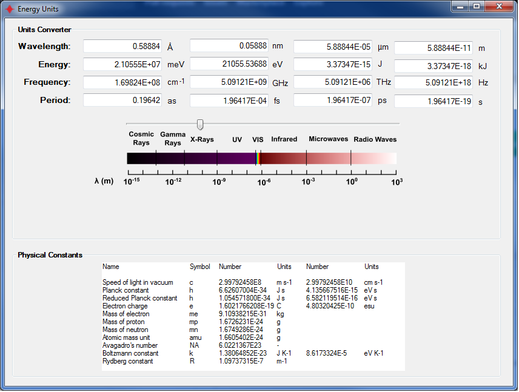

# EnergyUnitsConverter
This is a code with GUI to convert between different units commonly used in the fields of photonics, spectroscopy and others. It is written in C# and was built using Visual Studio 2010 and the .NET Framework 4. You can find the ready-to-use executables under the [bin folder](/bin). 

Feel free to contribute to it ! And, if you find any bug, please add an Issue [here](/issues). 
Here you can see some screenshots:

